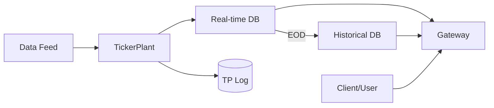

# kdb-plus

High-performance time-series data infrastructure framework based on kdb+/q.

## 🏗️ KDB+ Tick Architecture
Standard components for data lifecycle management.

- **TickerPlant (TP)**: Ingests data, records logs, and broadcasts to subscribers.
- **Real-time Database (RDB)**: Stores data in-memory and provides high-speed queries for the current day.
- **Historical Database (HDB)**: Manages historical data persisted on disk after End-of-Day (EOD) processing.
- **Gateway (GW)**: Unified entry point for queries, routing requests to RDB or HDB and aggregating results.

## ⚡ Technical Considerations

### 🕒 J2000 Time Standard
- **Standard**: Uses **2000.01.01 (J2000)** as the epoch (Day 0) instead of UNIX (1970).
- **Caution**: Mandatory time conversion required when interfacing with external systems (~30 years or `10,957` days difference).

### 🧵 Single-threaded Blocking
- **Nature**: q processes operate on a single-threaded event loop.
- **Risk**: Heavy computations can block the process, halting all network I/O and subscription handling.

### 📁 Time Partitioning & iNode Limits
- **Risk**: Excessive partitioning (e.g., by minute or second) can lead to **iNode** exhaustion on the OS level.
- **Mitigation**: Proper partitioning intervals must be defined based on data volume.

### 🛠️ Patching & Process Management
- **Issue**: Managing distributed `.q` files across multiple processes and limitations in dynamic logic updates.
- **Operation**: Potential downtime during process restarts for logic updates must be considered.

---
[한국어 버전 (Korean Version)](./README_ko.md)
