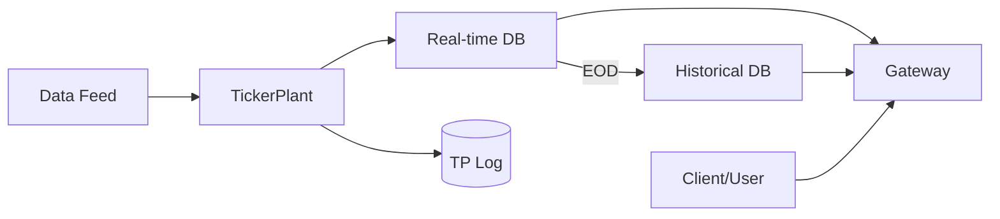

# kdb-plus

kdb+/q 기반의 고성능 시계열 데이터 인프라 구축 및 운영 프레임워크

## 🏗️ KDB+ tick 아키텍처
데이터 수명 주기에 따른 표준 구성 요소

- **TickerPlant (TP)**: 데이터 수신, 로그 기록 및 실시간 배포
- **Real-time Database (RDB)**: TP 데이터의 인메모리 적재 및 당일 데이터 고속 쿼리
- **Historical Database (HDB)**: 장 마감(EOD) 후 저장된 디스크 기반 과거 데이터 관리
- **Gateway (GW)**: 쿼리 통합 진입점, RDB/HDB 요청 라우팅 및 결과 집계

## ⚡ 기술적 주의사항

### 🕒 J2000 시간 표준
- **기준**: UNIX(1970) 대신 **2000.01.01 (J2000)**을 기준점(Day 0)으로 사용
- **주의**: 외부 시스템 연동 시 약 30년(`10,957`일)의 시간 차이 변환 필수

### 🧵 싱글 스레드 블로킹
- **특성**: q 프로세스는 싱글 스레드 이벤트 루프로 동작
- **위험**: 무거운 연산 실행 시 해당 프로세스의 모든 네트워크 I/O 및 구독 처리 중단

### 📁 시간 파티셔닝 iNode 제한
- **위험**: 파티션을 과도하게 세분화(분/초)할 경우, OS **iNode** 고갈로 인한 쓰기 실패 가능성
- **대응**: 데이터 볼륨에 맞는 적절한 파티션 주기 설정 필수

### 🛠️ 패치 및 프로세스 관리
- **문제**: 프로세스별 분산된 `.q` 파일 관리 및 실행 중인 로직의 동적 반영 제약
- **운영**: 로직 변경 시 프로세스 재시작에 따른 다운타임 고려 필요
